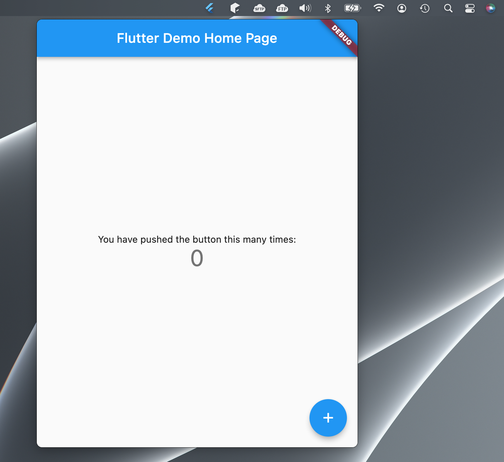

# Flutter Menubar App Example

This is a start template for building a menubar app in Flutter. In other words, you open the app by clicking an icon in the system tray. The app can be hidden and recalled, all the while saving its state.

There are probably much better ways to do this, especially if you're willing to write native code, but I just needed something quick that worked. This uses the following libraries:

* [tray_manager](https://github.com/leanflutter/tray_manager) - Creates the system tray icon
* [bitsdojo_window](https://github.com/bitsdojo/bitsdojo_window) - Customizes/sizes/positions the window

## Known Issues

1. Only tested for MacOS
2. Cannot click outside app to hide it. You must click the icon again
3. The app will only show up on the main screen, even if you have multiple and click the icon on a secondary screen

## Getting Started

This project is a starting point for a Flutter application.

A few resources to get you started if this is your first Flutter project:

- [Lab: Write your first Flutter app](https://flutter.dev/docs/get-started/codelab)
- [Cookbook: Useful Flutter samples](https://flutter.dev/docs/cookbook)

For help getting started with Flutter, view our
[online documentation](https://flutter.dev/docs), which offers tutorials,
samples, guidance on mobile development, and a full API reference.

